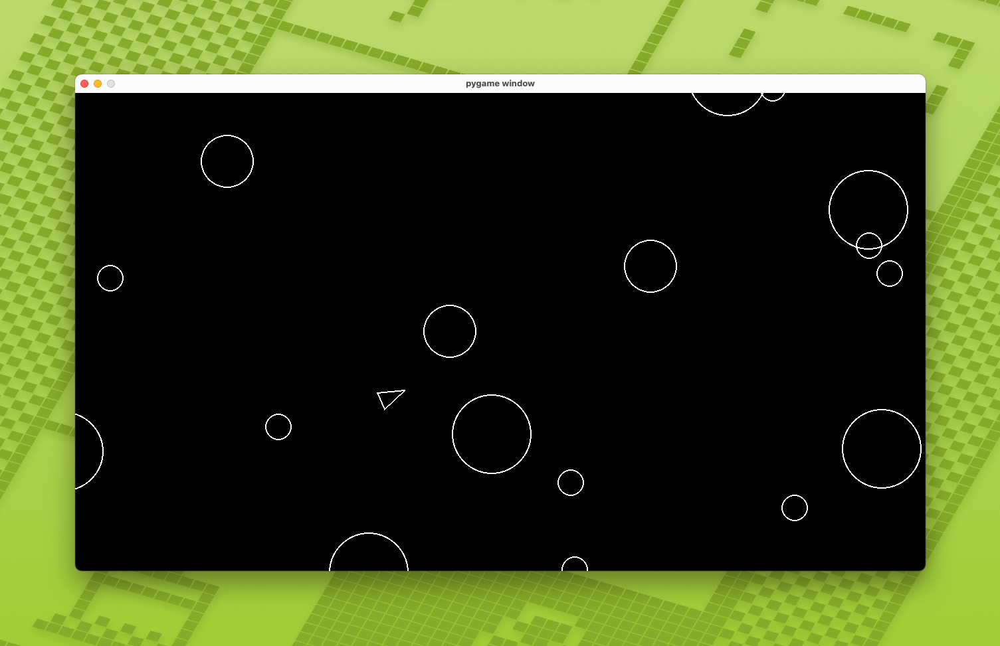

# asteroids-python

Hilariously simple Asteroids clone in Python using pygame. Based on the
[boot.dev](https://boot.dev) guided project.



## How to play

Naturally, this game requires a local installation of Python 3 on your machine.
Additionally, you'll need a desktop environment to spawn the game window. Once
requirements are met, follow the instructions below to set up and play the game.

1. Clone the repository and `cd` into it
2. Activate the venv environment:

```sh
source venv/bin/activate
```

3. Install the requirements:

```sh
pip install -r requirements.txt
```

4. Launch the game:

```sh
python3 main.py
```

## Controls

- `W` to move forward
- `A` or `D` to rotate the ship left or right
- `SPACE` to fire

## TODO

If I decide to continue to build the game beyond the boot.dev project scope,
here are the things I'd like to implement:

- [ ] HUD
  - [ ] Score
  - [ ] Lives
- [ ] Create scoring system
- [ ] Multiple lives
- [ ] Game Over screen with option to play again or quit
- [ ] Audio and music
- [ ] Title or attraction screen
- [ ] Parallaxed starfield
- [ ] Ship physics (accel/decel)
- [ ] Different shapes for asteroids
- [ ] Despawn asteroids that leave the screen
- [ ] Difficulty increase
- [ ] Progression system
- [ ] Scoreboard
- [ ] Triangular hitbox for ship
- [ ] Defensive items
- [ ] Offensive items
- [ ] Change shape of bullets
- [ ] Multiple weapons
- [ ] V-Sync (currently locked to 60 fps)
- [ ] and more